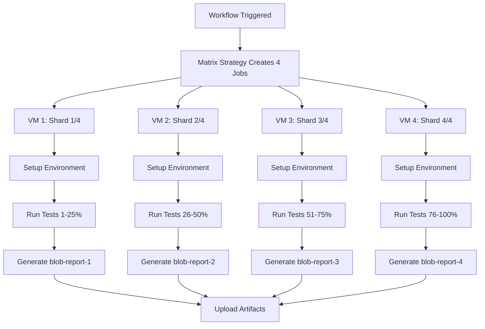
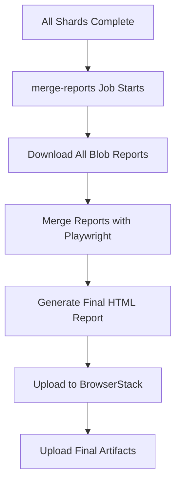

# Playwright Test Sharding with ubuntu-latest-2-8 VMs

## Document Information
- **Project**: Web Playwright Test Automation
- **Repository**: repo-name

---

## Table of Contents
1. [Overview](#overview)
2. [Sharding Architecture](#sharding-architecture)
3. [VM Configuration](#vm-configuration)
4. [Implementation Details](#implementation-details)
5. [Execution Flow](#execution-flow)
6. [Benefits and Trade-offs](#benefits-and-trade-offs)
7. [Configuration Files](#configuration-files)
8. [Monitoring and Debugging](#monitoring-and-debugging)

---

## Overview

This document explains how test sharding is implemented in the Web Playwright automation framework using GitHub Actions with `ubuntu-latest-2-8` virtual machines.

### What is Test Sharding?
Test sharding is a parallel execution strategy that divides a test suite into smaller chunks (shards) that run simultaneously across multiple machines, reducing overall execution time.

### Current Implementation
- **Shard Count**: 4 parallel shards
- **VM Type**: ubuntu-latest-2-8 (8 cores, 32GB RAM)
- **Distribution**: Automatic load balancing by Playwright
- **Merge Strategy**: Blob reports consolidated into final HTML report

---

## Sharding Architecture

```
┌─────────────────────────────────────────────────────────────┐
│                    GitHub Actions Workflow                  │
├─────────────────────────────────────────────────────────────┤
│  Job: execute_test (Matrix Strategy)                        │
│  ┌─────────────┬─────────────┬─────────────┬─────────────┐  │
│  │   Shard 1   │   Shard 2   │   Shard 3   │   Shard 4   │  │
│  │  VM ubuntu  │  VM ubuntu  │  VM ubuntu  │  VM ubuntu  │  │
│  │  8-core     │  8-core     │  8-core     │  8-core     │  │
│  │  32GB RAM   │  32GB RAM   │  32GB RAM   │  32GB RAM   │  │
│  │             │             │             │             │  │
│  │ Tests 1-25% │ Tests 26-50%│ Tests 51-75%│ Tests 76-100%│ │
│  │             │             │             │             │  │
│  │ blob-report │ blob-report │ blob-report │ blob-report │  │
│  │     -1      │     -2      │     -3      │     -4      │  │
│  └─────────────┴─────────────┴─────────────┴─────────────┘  │
│                              │                              │
│                              ▼                              │
│  Job: merge-reports                                         │
│  ┌─────────────────────────────────────────────────────────┐ │
│  │              Single VM ubuntu-latest-2-8                │ │
│  │                                                         │ │
│  │  Download all blob reports → Merge → Generate HTML      │ │
│  │                                                         │ │
│  │  Final Report + BrowserStack Upload                     │ │
│  └─────────────────────────────────────────────────────────┘ │
└─────────────────────────────────────────────────────────────┘
```

---

## VM Configuration

### Hardware Specifications
Each `ubuntu-latest-2-8` VM provides:
- **CPU**: 8 cores
- **Memory**: 32 GB RAM
- **Storage**: 14 GB SSD
- **Network**: High-speed connectivity
- **OS**: Ubuntu (latest LTS)

### Resource Allocation
```yaml
runs-on: ubuntu-latest-2-8
strategy:
  fail-fast: false
  matrix:
    shardIndex: [1, 2, 3, 4]
    shardTotal: [4]
```

### Cost Implications
- **Parallel VMs**: 4 VMs running simultaneously
- **Execution Time**: ~25% of sequential execution time
- **Total VM Minutes**: Similar to sequential (4 VMs × 25% time)
- **Benefit**: Faster feedback, reduced CI pipeline time

---

## Implementation Details

### 1. Job Matrix Strategy

The workflow uses GitHub Actions matrix strategy to create parallel jobs:

```yaml
execute_test:
  runs-on: ubuntu-latest-2-8
  strategy:
    fail-fast: false
    matrix:
      shardIndex: [1, 2, 3, 4]
      shardTotal: [4]
```

**Key Points:**
- `fail-fast: false` ensures all shards complete even if one fails
- Matrix creates 4 independent jobs
- Each job gets unique `shardIndex` and shared `shardTotal`

### 2. Test Execution Commands

Different test types use sharding:

```bash
# Smoke Tests
npm run test:qa:smoke -- --shard=${{ matrix.shardIndex }}/${{ matrix.shardTotal }}

# Regression Tests  
npm run test:qa:reg -- --shard=${{ matrix.shardIndex }}/${{ matrix.shardTotal }}

# Full Test Suite
npm run test:qa -- --shard=${{ matrix.shardIndex }}/${{ matrix.shardTotal }}
```

### 3. Playwright Configuration

The `playwright.config.ts` supports sharding with:

```typescript
fullyParallel: true,
workers: process.env.CI ? 1 : undefined,
reporter: process.env.CI ? [
  ["blob", { outputDir: 'playwright-blob-report' }],
  ["html", { open: 'never' }],
  ["junit", { outputFile: 'junit-test-report.xml' }],
] : [...]
```

**Key Settings:**
- `fullyParallel: true` - Enables parallel test execution
- `workers: 1` in CI - One worker per shard to avoid over-parallelization
- `blob` reporter - Essential for report merging

---

## Execution Flow

### Phase 1: Parallel Test Execution



### Phase 2: Report Merging



### Detailed Steps

1. **Environment Setup** (Each Shard):
   ```bash
   - Checkout repository
   - Setup Node.js 22
   - Configure npm authentication
   - Install dependencies
   - Install Playwright browsers
   ```

2. **Test Execution** (Parallel):
   ```bash
   # Each shard runs subset of tests
   npx playwright test --shard=X/4
   ```

3. **Report Generation** (Each Shard):
   ```bash
   # Blob report for merging
   playwright-blob-report/
   ```

4. **Artifact Upload** (Each Shard):
   ```yaml
   uses: actions/upload-artifact@v4
   with:
     name: blob-report-${{ matrix.shardIndex }}
     path: playwright-blob-report
   ```

5. **Report Merging** (Single VM):
   ```bash
   # Download all blob reports
   actions/download-artifact@v4
   
   # Merge into final report
   npx playwright merge-reports --reporter html ./all-blob-reports
   ```

---

## Benefits and Trade-offs

### ✅ Benefits

1. **Faster Execution**
   - ~75% reduction in CI pipeline time
   - Faster feedback for developers
   - Reduced queue time for other workflows

2. **Resource Efficiency**
   - Full VM resources (8 cores, 32GB) per shard
   - Better CPU utilization
   - Parallel browser instances

3. **Fault Tolerance**
   - `fail-fast: false` allows partial completion
   - Individual shard failures don't block others
   - Comprehensive error reporting per shard

4. **Scalability**
   - Easy to adjust shard count (modify matrix)
   - Load balancing handled automatically
   - Supports different test suites

### ⚠️ Trade-offs

1. **Resource Consumption**
   - 4x VM instances running simultaneously
   - Higher peak resource usage
   - Potential GitHub Actions minute consumption

2. **Complexity**
   - Additional merge step required
   - More complex debugging
   - Dependency on artifact system

3. **Setup Overhead**
   - Each shard repeats environment setup
   - Multiple dependency installations
   - Browser installation per VM

---

## Configuration Files

### 1. GitHub Workflow (.github/workflows/playwright-automated-run.yml)

**Key Sections:**

```yaml
# Matrix Configuration
strategy:
  fail-fast: false
  matrix:
    shardIndex: [1, 2, 3, 4]
    shardTotal: [4]

# Test Execution with Sharding
- name: Run Smoke Tests
  if: env.TEST_TYPE == 'smoke'
  run: npm run test:qa:smoke -- --shard=${{ matrix.shardIndex }}/${{ matrix.shardTotal }}

# Artifact Management
- name: Upload blob report to GitHub Actions Artifacts
  uses: actions/upload-artifact@v4
  with:
    name: blob-report-${{ matrix.shardIndex }}
    path: playwright-blob-report
```

### 2. Playwright Configuration (playwright.config.ts)

**Sharding-Specific Settings:**

```typescript
export default defineConfig({
  fullyParallel: true,
  workers: process.env.CI ? 1 : undefined,
  
  reporter: process.env.CI ? [
    ["blob", { outputDir: 'playwright-blob-report' }],
    ["html", { open: 'never' }],
    ["junit", { outputFile: 'junit-test-report.xml' }],
  ] : [...],
});
```

### 3. Package.json Scripts

```json
{
  "scripts": {
    "test:qa:smoke": "playwright test --project=chromium-qa --grep=@smoke",
    "test:qa:reg": "playwright test --project=chromium-qa --grep=@regression", 
    "test:qa": "playwright test --project=chromium-qa"
  }
}
```

---

## Monitoring and Debugging

### 1. Execution Monitoring

**GitHub Actions UI:**
- Individual shard progress tracking
- Parallel execution visualization
- Resource usage monitoring

**Console Output:**
```bash
echo "🚀 Running Automated Tests with the following configuration:"
echo "Test Type: $TEST_TYPE"
echo "Sharding: ${{ matrix.shardIndex }}/${{ matrix.shardTotal }}"
```

### 2. Debugging Failed Shards

**Individual Shard Logs:**
- Each shard maintains separate logs
- Specific error tracking per shard
- Independent artifact generation

**Report Analysis:**
```bash
# Check blob report contents
ls -la all-blob-reports/

# Verify merge process
npx playwright merge-reports --reporter html ./all-blob-reports
```

### 3. Performance Metrics

**Key Metrics to Monitor:**
- Total execution time vs. sequential
- Resource utilization per shard
- Test distribution balance
- Failure rate per shard

**BrowserStack Integration:**
- Consolidated test results
- Cross-shard analytics
- Performance trending

---

## Troubleshooting Common Issues

### Issue 1: Uneven Test Distribution

**Symptoms:**
- One shard takes significantly longer
- Unbalanced resource usage

**Solutions:**
- Playwright automatically balances by file size and history
- Consider test organization and file structure
- Monitor execution times and adjust if needed

### Issue 2: Merge Failures

**Symptoms:**
- Missing blob reports
- Merge step failures

**Solutions:**
```bash
# Check blob report existence
if [ ! -d "all-blob-reports" ] || [ -z "$(ls -A all-blob-reports)" ]; then
  echo "No blob reports found to merge"
  exit 0
fi
```

### Issue 3: Resource Constraints

**Symptoms:**
- VM resource exhaustion
- Browser startup failures

**Solutions:**
- Current configuration (1 worker per shard) optimized for 8-core VMs
- Monitor memory usage during test execution
- Consider browser memory settings

---

## Future Enhancements

### 1. Dynamic Sharding
- Adjust shard count based on test suite size
- Environment-specific sharding strategies
- Intelligent test distribution

### 2. Enhanced Monitoring
- Real-time shard performance metrics
- Resource utilization dashboards
- Predictive execution time estimation

### 3. Optimization Opportunities
- Shared dependency caching across shards
- Browser binary sharing
- Test result caching strategies

---

## Conclusion

The current sharding implementation provides an excellent balance of:
- **Performance**: ~75% faster execution
- **Reliability**: Fault-tolerant parallel execution  
- **Maintainability**: Clear separation of concerns
- **Scalability**: Easy configuration adjustments

The use of `ubuntu-latest-2-8` VMs ensures each shard has sufficient resources (8 cores, 32GB RAM) to handle browser automation effectively while maintaining cost efficiency through parallel execution.

---

## Appendix

### A. Resource Calculation Example

**Sequential Execution:**
- 1 VM × 40 minutes = 40 VM-minutes
- Total CI time: 40 minutes

**Sharded Execution (Current):**
- 4 VMs × 10 minutes = 40 VM-minutes  
- Total CI time: 10 minutes
- **Improvement**: 75% faster feedback

### B. GitHub Actions Pricing Impact

Based on GitHub Actions pricing:
- Same total VM-minutes consumed
- Faster CI pipeline completion
- Improved developer productivity
- Better resource utilization during peak hours

### C. Command Reference

```bash
# Run specific shard locally
npm run test:qa:smoke -- --shard=1/4

# Generate blob report
npx playwright test --reporter=blob

# Merge blob reports
npx playwright merge-reports --reporter html ./blob-reports

# Upload to BrowserStack
npm run upload:browserstack:simple
```

---
